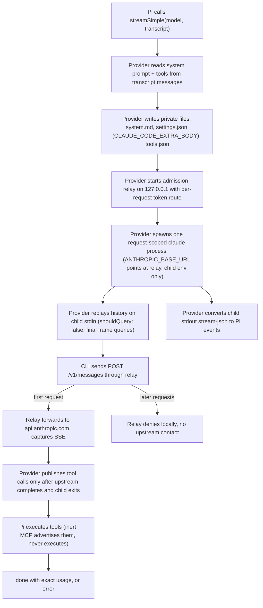

# Pi Claude DirectSDK

Use Claude inside Pi through the unmodified Claude Code executable.
Pi owns the transcript, tools, approvals, and retries; the CLI supplies
subscription authentication as a model transport. One Pi model call spawns
one request-scoped `claude` process and admits at most one upstream
Messages request.

## How it works



The provider never executes native tools, manages login, reads credentials,
or falls back to another billing route. Missing CLI and logged-out CLI fail
with actionable errors.

## Requirements

- Node 20+
- Claude Code in the qualified range (`>=2.1.263 <2.2.0`, see
  `QUALIFIED_CLI_RANGE` in `src/models.ts`), logged in via `claude auth login`
- A Claude paid plan for subscription use (the free plan excludes the CLI)

## Use

Load the extension and list models:

```sh
pi -e ./extensions/claude-directsdk/index.ts --list-models claude-directsdk
```

Run a prompt (model ids include `sonnet`, `opus`, `haiku` plus versioned routes):

```sh
pi -e ./extensions/claude-directsdk/index.ts -p --model claude-directsdk/sonnet -- "Hello."
```

Interactive, print, and resumed sessions work. Session files persist the
signed-thinking carrier, so resumed turns replay exactly.

## Tool compatibility

Built-in Pi tools (`read`, `bash`, `edit`, `write`) work. They request
best-effort (`strict: "prefer"`) constrained decoding, which this transport
accepts unenforced: neither the Anthropic protocol nor the fixed CLI binary
offers a decoding knob, matching Pi's own Anthropic adapter. Malformed native
tool input still fails loudly instead of corrupting a call. Hard requirements
(`strict: "require"`, `grammar` schemas) stay rejected with an error.

## Tests

```sh
npm test  # offline e2e: extension load, install hint. Safe for CI.
```

Opt-in suites (never run by default):

```sh
# Full pipeline + abort against the real CLI. Loopback fixture, no cost.
PI_DIRECTSDK_CLI=/path/to/claude npm test
# Gateway text, tool call, and multi-turn replay via OpenRouter. Paid.
PI_DIRECTSDK_GATEWAY=1 PI_DIRECTSDK_CLI=/path/to/claude npm test
```

## Costs

Per-model cost metadata is Anthropic list price and is reported as an
estimate, never as a subscription charge. Failed or interrupted requests are
never reported as free.

## Status

Implemented and qualified: offline e2e, loopback pipeline against CLI 2.1.281,
gateway runs against Opus 5.5, and live subscription runs (text, Pi-side tool
execution, cancel cleanup, ~92% follow-up cache reads, 5-round tool chaining,
session resume).

## Acknowledgments

Behavioral reference:
[Hermes Claude Subscription DirectSDK](https://github.com/NousResearch/hermes-plugin-claude-subscription-directsdk)
(MIT). This project copies its behavior contract, not its code.

## License

MIT. See `LICENSE`.
