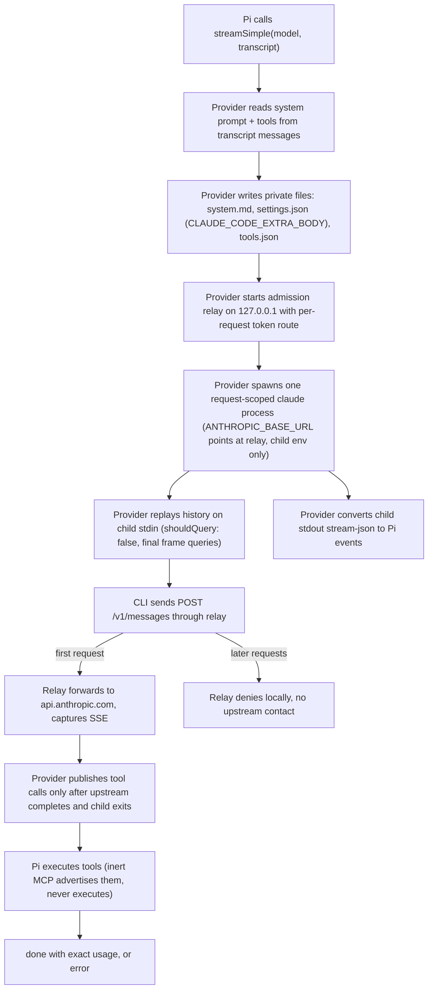

# Pi Claude DirectSDK

[](https://www.npmjs.com/package/pi-claude-directsdk)

Use Claude inside Pi through the unmodified Claude Code executable.
Pi owns the transcript, tools, approvals, and retries; the CLI supplies
subscription authentication as a model transport. One Pi model call spawns
one request-scoped `claude` process and admits at most one upstream
Messages request.

## How it works


```mermaid
flowchart TD
    A["Pi calls streamSimple(model, transcript)"] --> B["Provider reads system prompt + tools from transcript messages"]
    B --> C["Provider writes private files: system.md, settings.json (CLAUDE_CODE_EXTRA_BODY), tools.json"]
    C --> D["Provider starts admission relay on 127.0.0.1 with per-request token route"]
    D --> E["Provider spawns one request-scoped claude process (ANTHROPIC_BASE_URL points at relay, child env only)"]
    E --> F["Provider replays history on child stdin (shouldQuery: false, final frame queries)"]
    F --> G["CLI sends POST /v1/messages through relay"]
    G -->|first request| H["Relay forwards to api.anthropic.com, captures SSE"]
    G -->|later requests| I["Relay denies locally, no upstream contact"]
    E --> J["Provider converts child stdout stream-json to Pi events"]
    H --> K["Provider publishes tool calls only after upstream completes and child exits"]
    K --> L["Pi executes tools (inert MCP advertises them, never executes)"]
    L --> M["done with exact usage, or error"]
```

The provider never executes native tools, manages login, reads credentials,
or falls back to another billing route. Missing CLI and logged-out CLI fail
with actionable errors.

## Requirements

- Node 20+
- Claude Code in the qualified range (`>=2.1.263 <2.2.0`, see
  `QUALIFIED_CLI_RANGE` in `src/models.ts`), logged in via `claude auth login`
- A Claude paid plan for subscription use (the free plan excludes the CLI)

Verified with Pi 1.0.2 and Claude Code 2.1.281.

## Install and activate

Install the qualified Claude Code version and sign in through its official login:

```sh
npm install -g --ignore-scripts=false @anthropic-ai/claude-code@2.1.281
claude auth login
pi install git:github.com/joaomj/pi-claude-directsdk
pi --model claude-directsdk/haiku
```

Restart Pi after installation. DirectSDK uses the CLI login, not Pi's Anthropic
login. The npm command enables the Claude Code installer for this command only.

The model catalog does not guarantee account entitlement. Start with `haiku`
for a small request. Models marked as requiring usage credits can incur separate
charges. Disable additional paid usage in your Claude account if you want only
the included subscription allowance.

## Use

To load a local checkout without installing it, list models:

```sh
pi -e ./extensions/claude-directsdk/index.ts --list-models claude-directsdk
```

Run a prompt (model ids include `sonnet`, `opus`, `haiku` plus versioned routes):

```sh
pi -e ./extensions/claude-directsdk/index.ts -p --model claude-directsdk/sonnet -- "Hello."
```

Interactive, print, and resumed sessions work. Session files persist the
signed-thinking carrier, so resumed turns replay exactly.

## Tool compatibility

Built-in Pi tools (`read`, `bash`, `edit`, `write`) and `codemode` are
accepted. Best-effort JSON-schema constraints (`strict: "prefer"`) and
provider-specific grammar variants fall back to normal JSON-schema tool
calling, matching Pi's Anthropic adapter. This transport does not enforce
constrained decoding. Malformed native tool input still fails with an error.
Required strict schemas (`strict: "require"`) remain rejected.

## Tests

```sh
npm test  # Offline checks, including one-shot child lifetime. No subscription usage.
```

Opt-in suites (never run by default):

```sh
# Full pipeline + abort against the real CLI. Loopback fixture, no cost.
PI_DIRECTSDK_CLI=/path/to/claude npm test
# Gateway text, tool call, and multi-turn replay via OpenRouter. Paid.
PI_DIRECTSDK_GATEWAY=1 PI_DIRECTSDK_CLI=/path/to/claude npm test
```

### Focused regression checks

```sh
npm run build
PI_DIRECTSDK_CLI="$(command -v claude)" node --test \
  --test-name-pattern='grammar tool|one-shot supervision' \
  .build/tests/e2e/fake-upstream.test.js \
  .build/tests/e2e/process-lifetime.test.js
```

The grammar check uses the real CLI with fixture credentials and a loopback
upstream. It verifies JSON-schema fallback, tool-call delivery, single-request
admission, and rejection of required strict decoding before an upstream call.
The lifetime check runs in a separate process. It verifies that the caller
receives the child's final exit status after its output streams close.
Neither check consumes subscription allowance.

## Costs

Per-model cost metadata is Anthropic list price and is reported as an
estimate, never as a subscription charge. Failed or interrupted requests are
never reported as free.

## Status

Implemented and qualified: offline e2e, loopback pipeline against CLI 2.1.281,
gateway runs against Opus 5.5, and live subscription runs (text, Pi-side tool
execution, cancel cleanup, ~92% follow-up cache reads, 5-round tool chaining,
session resume).

## Acknowledgments

Behavioral reference:
[Hermes Claude Subscription DirectSDK](https://github.com/NousResearch/hermes-plugin-claude-subscription-directsdk)
(MIT). This project copies its behavior contract, not its code.

## License

MIT. See `LICENSE`.
