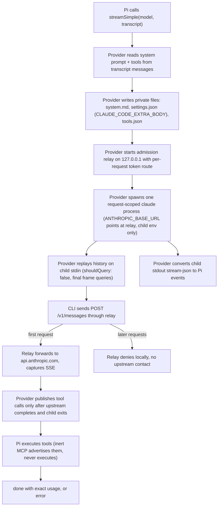

# Architecture

One Pi model call spawns one request-scoped `claude` process and admits at most one upstream Messages request.

## Components

### Provider entry (`src/provider.ts`, `extensions/claude-directsdk/index.ts`)

The extension registers provider id `claude-directsdk` with a static pinned catalog (`MODELS`). `refreshModels` merges live picker labels for known routes. Unknown live routes stay unlisted because the provider has no verified cost metadata for them. Any refresh failure keeps the pinned catalog.

`streamSimple` delegates to `streamClaudeDirectSdk` in `src/stream.ts`.

### History replay (`src/replay.ts`)

Pi owns the transcript. Each call replays prior assistant, user, and tool-result frames in native `stream-json` form through a fresh child.

Rules:

- Historical user frames carry `shouldQuery: false` and expect a zero-turn acknowledgment. Only the final frame may generate.
- The last frame must be a nonempty user or tool-result message. Assistant prefill is unsupported.
- Unsupported history is rejected with a `replay` error, never flattened into prose.
- Signed native thinking survives only inside a durable carrier (`pi-claude-directsdk/native`) attached to the Pi assistant message. The carrier is restored only when the visible projection (text, thinking, tool calls) still matches. Any edit drops the native blocks. Thinking without a signature cannot be replayed. Session files persist the carrier, so resumed turns replay exactly.

### Request assembly (`src/request.ts`)

The current system prompt and tool schemas travel through per-request private files with owner-only permissions:

- `system.md`: the system prompt.
- `settings.json`: carries `CLAUDE_CODE_EXTRA_BODY`.
- `tools.json`: the inert MCP manifest.
- `inert-mcp.mjs`: the inert MCP server source.

Files avoid OS argument and environment-string limits. Authentication and identity headers are never replaced. The relay preserves them.

The child argv (`buildArgv`) runs the CLI with `--input-format stream-json`, `--output-format stream-json`, `--verbose`, `--include-partial-messages`, `--max-turns 1`, `--permission-mode dontAsk`, `--no-session-persistence`, `--strict-mcp-config`, `--disable-slash-commands`, and an empty `--setting-sources`. `--max-turns 1` is accepted by the qualified CLI even though recent `--help` output hides it. The fake-upstream gate re-verifies it on every CLI version change.

The child environment (`buildChildEnv`) points `ANTHROPIC_BASE_URL` at the relay. It sets native isolation flags (`ENABLE_TOOL_SEARCH=false`, `CLAUDE_CODE_DISABLE_NONESSENTIAL_TRAFFIC=1`, `CLAUDE_CODE_MAX_RETRIES=0`, `DISABLE_AUTO_COMPACT=1`, `DISABLE_COMPACT=1`, `CLAUDE_CODE_TOTAL_TOKENS_REMINDER=off`). Sampling controls from Pi options (`temperature`, `top_p`) are dropped because subscription routes reject them.

### Admission relay (`src/admission.ts`)

The relay binds an ephemeral loopback port with a random per-request route (`/admit/<token>`). It forwards only the first upstream Messages request and rejects later native recovery or retry attempts locally with `PI_MODEL_ADMISSION_CONSUMED`. Only HTTP transfer encoding changes. Request identity and payload stay native.

The relay reconstructs the upstream assistant message from the SSE stream (`SseCapture`) and records status, request id, failure text, and an error body (capped at 64 KiB). Upstream targets must be HTTPS, except loopback HTTP fixtures used by tests. Request bodies are capped at 512 MiB.

### Child supervision (`src/process.ts`)

Each Pi model call owns one child in its own process group. Abort and failure kill the full tree. This matters on Windows, where the npm `claude` shim is `cmd.exe` -> `node` and a plain `kill()` would orphan the node child that holds the request open. Stdout is consumed as newline-delimited JSON with an idle deadline that resets on every received line. The caller receives the child final exit status after its output streams close.

### Stream conversion (`src/stream.ts`)

The provider converts child stdout `stream-json` to Pi events. Native tool calls are published only after the first upstream response is complete and the child has exited. Usage and stop reason come from the authoritative native usage. Incomplete native or upstream responses produce `incomplete` or `upstream` errors.

### Inert MCP (`src/inert-mcp.ts`)

The MCP server name in the native child is `pi`. Tool names are `mcp__pi__<name>`. The server advertises Pi tools so the CLI can call them. It never executes them. Pi alone executes tools.

### Setup probes (`src/setup.ts`)

`setupStatus` runs `claude auth status` against the local credential store. `discoverModels` runs the `initialize` handshake to enumerate the account picker without a Messages request. The admission relay proves the handshake sends no upstream call by counting requests. Anything unexpected returns a safe fallback so callers use the pinned catalog rather than failing setup.

## Guarantees

- The provider never executes native tools.
- The provider never manages login or reads credentials.
- The provider never falls back to another billing route.
- Missing CLI and logged-out CLI fail with actionable errors. See [troubleshooting.md](troubleshooting.md).

## Model routing

The model catalog is pinned in `src/models.ts` (`CATALOG`, `ALIAS_IDS`, `ALIASES`). That file is the authority for ids, aliases, context windows, and cost rates. Prose here states only the stable rules:

- Short aliases resolve to canonical native routes.
- Routes with a 1,000,000-token window take the `[1m]` native suffix. Haiku 4.5 stays un-suffixed.
- `QUALIFIED_CLI_RANGE` pins the qualified CLI versions. Routing, replay acknowledgments, and admission behavior are version-sensitive. Re-run the fake-upstream gate (see [testing.md](testing.md)) before widening the range.
- `refreshModels` annotates known pinned routes with live picker labels. Unknown live routes stay unlisted. Any discovery failure keeps the pinned catalog.

## Tool transport

Pi owns tool execution. The native child advertises Pi tools through the inert MCP server and never executes them. The authority is `src/request.ts` (`buildRequestBody`, `normalizeInputSchema`). The stable rules:

- Only `tool_choice` `auto` and `none` are supported.
- Constrained decoding is not enforced. Grammar and best-effort (`strict: "prefer"`) annotations fall back to normal JSON-schema tool calling. Required strict (`strict: "require"`) stays rejected. Malformed native tool input still fails downstream.
- Native tool calls reach Pi only after the first upstream response is complete and the child has exited.
